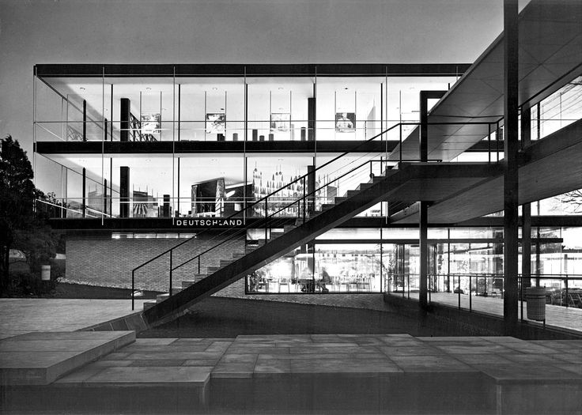

# Ethical UX

Matthew Reidsma // Grand Valley State University

-----

<!-- .slide: data-background-image="img/villarotunda.jpg" -->

Photograph: Stefan Bauer. [https://en.wikipedia.org/wiki/File:Villa_Rotonda_front.jpg](https://en.wikipedia.org/wiki/File:Villa_Rotonda_front.jpg)

Note: 
In the sixteenth century, the architect Andrea Palladio began work on the  "Villa La Rotunda," in Northern Italy. It is considered to be Palladio's master work, a summation of the ideas of one of the greatest architects in history. 

Palladio himself was inspired by Ancient Rome, and how the architecture of that age reflected society's values. So, on the stairways and pediments of the Villa La Rotunda, he placed sculptures that embodied the values and ideals of Italian society in the guise of figures from Classical mythology. Not only did Palladio reflect ideal values in the orientation of the building and its proportions, but he literally represented these values as sculptures on the building's facade. 

-----

Andrea Palladio, *Four Books of Architecture* (1788, Isaac Ware, London). Front page.

Note:
Palladio's other great legacy was his book, *The Four Books of Architecture*. Two hundred years after his death, editions of the book were still being printed with a frontespiece depicting the maidens of Architecture paying homage to the "Queen of Virtue."

-----

<!-- .slide: data-background-image="img/deBotton.jpg" -->

### Political and ethical ideas can be written into window frames and door handles.

#### Alain de Botton

de Botton, A. (2006). *The Architecture of Happiness*. New York: Vintage International. p.93

Note:
This wasn't an unusual proposition, that created things reflected societal values. Architects and artists from the Ancient Romans on through Palladio and his heirs intentionally crafted their ideal values into their creations. (Whether the men and women that lived out their lives under these symbolic ideals lived up to them is another question.)

-----

Albert Speer's German pavillion from the 1937 World's Fair

Note: 
Albert Speer’s German pavillion for the 1937 World’s Fair, representing the German fascist government. 500 foot tall improsing, agressive tower of might.

-----

Egon Eiermann's Federal Republic of Germany pavillion for the 1958 World's Fair

Note: 
21 years later, the Federal Republic of Germany’s 1958 world’s fair pavillion designed by Egon Eiermann. de Botton: “horizontiality to suggest calm, lightness to imply gentleness, ans transparency to evoke democracy.”

Not literal representations of the values in the form of gods or statues or frescos, but potent representations of the values of those who created them nonetheless.

-----

<!-- .slide: data-background-image="img/orphanides.jpg" -->

### System design reflects the designer's values and the cultural context.

#### Andreas Orphanides

[Architecture is politics: The power and the perils of systems design](https://docs.google.com/presentation/d/180dMBG26xMYB9gfIotoUyCBQfO3XfmHiJGQjvn58GwY/edit?pref=2&pli=1#slide=id.gf03c9bb35_0_143)

Note:
This is true of all created things, not just architecture. In his insightful talk TK, UX Libs II alum Andreas Orphanides notes that nearly all created and designed things are systems, and systems are just models of reality. When we create any model of reality, TK

-----

# What are our Values?

-----

Do we value our users over our prefered workflows?

-----

[Brooklyn Public Library's Online Library Card Application](TK)

-----

Do we value our users' privacy over our fetish for data collection?

-----

Do we value accuracy and equity more than the appearance of relevance?

-----

<!-- .slide: data-background-image="img/montero.jpg" -->

### This is how bad design makes it out into the world. Not due to malicious intent, but with no intent at all.

#### Mike Montero

[How Designers Destroyed the World](https://vimeo.com/68470326)

-----

### The library world has been far too gullible, far too willing to regard any technical advance as a service advance.

#### Jonathan D. Lauer & Steve McKinzie

Lauer, J. & McKinzie, S. (2002/2003). Bad moon rising: a candid examination of digital reference and what it means to the profession. *The Reference Librarian*, 79/80, 46.

-----

<!-- .slide: data-background-image="img/hanson.png" -->

### Our expertise, our service ethic, and our values remain our greatest strengths. 

#### Cody Hanson

[Libraries are Software](http://codyhanson.com/writing/software.html)

-----

<!-- .slide: data-background-image="img/hanson.png" -->

### But for us to have the impact we seek in the lives of our users, we must encode our services and our values in the software we provide.

#### Cody Hanson

[Libraries are Software](http://codyhanson.com/writing/software.html)

-----

# Ethical Design

-----

<!-- .slide: data-background-image="img/goodman.jpg" -->

### Technology is a branch of moral philosophy, not of science.

#### Paul Goodman

[Goodman, P. (1969). Can Technology Be Humane? *New York Review of Books*, Nov. 20, 1969](http://www.nybooks.com/articles/1969/11/20/can-technology-be-humane)

-----

https://twitter.com/Cennydd/status/831431945930293248

Note:

-----

<!-- .slide: data-background-image="img/papanek.jpg" -->

### [The designer’s] social and moral judgment must be brought into play long before [she] begins to design...

#### Victor Papanek

Papanek, V. (1971). *Design for the Real World: Human ecology and social change*. New York: Pantheon Books. p. 45.

-----

<!-- .slide: data-background-image="img/papanek.jpg" -->

### In other words, will [her] design be on the side of the social good or not.

#### Victor Papanek

Papanek, V. (1971). *Design for the Real World: Human ecology and social change*. New York: Pantheon Books. p. 46.

-----

<!-- .slide: data-background-image="img/montero.jpg" -->

### We need to fear the consequences of our work more than we love the cleverness of our ideas.

#### Mike Montero

[How Designers Destroyed the World](https://vimeo.com/68470326)

-----

<!-- .slide: data-background-image="img/postel.jpg" -->

https://en.wikipedia.org/wiki/File:Jon_Postel_sitting_in_office.jpg

-----

<!-- .slide: data-background-image="img/postel.jpg" -->

### Robustness Principle: Be conservative in what you do, be liberal in what you accept from others.

#### John Postel

[DOD Standard: Transmission Control Protocol, January 1980](https://tools.ietf.org/html/rfc761#page-13)

-----

# Design for Failure

-----

<!-- Personas, privacy, accuracy & equity -->

<!-- .slide: data-background-image="img/hall.jpg" -->

### By designing for yourself or your team, you are potentially building discrimination right into your product.

#### Erica Hall

Hall, E. (2013). *Just Enough Research*. New York: A Book Apart. p. 79

-----

<!-- .slide: data-background-image="img/mcgrane.jpg" -->

### Who am I designing for? The expert automaton, programmed to complete each task flawlessly? Or the messy, error-prone, distracted human?

#### Karen McGrane

McGrane, K. (2011). Lesson. *The Manual (2)*. p.45

-----

<!-- .slide: data-background-image="img/meyer.jpg" -->

### You don't get to decide whether or not users in crisis want to use your site.

#### Eric Meyer

[TK](http://thewebahead.net/91)

-----

<!-- .slide: data-background-image="img/ekstrom.jpg" -->

### Behind every algorithm is always a person, a person with a set of personal beliefs that no code can ever completely eradicate.

#### Andreas Ekström

[The Moral Bias Behind Your Search Results](https://www.ted.com/talks/andreas_ekstrom_the_moral_bias_behind_your_search_results)

-----

<!-- .slide: data-background-image="img/meyer.jpg" -->

### The failure wasn’t in their design, but in the narrowness of their vision.

#### Eric Meyer

Meyer, E. and Wachter-Boettcher, S. (2016). *Design for Real Life*. New York:  A Book Apart. p.9

-----

<!-- .slide: data-background-image="img/gillespie.jpg" -->

### 'Relevant' is a fluid and loaded judgment...engineers must decide what looks 'right' and tweak their algorithm to attain that result.

#### Tarleton Gillespie

Gillespie, T. (2014). The Relevance of Algorithms. In T. Gillespie, P. Boczkowski & K. Foot (Eds.), Media Technologies: Essays on Communication, Materiality, and Society. Cambridge, MA: MIT Press. p. 175

-----

<!-- .slide: data-background-image="img/gillespie.jpg" -->

### ...or make changes based on evidence from their users, treating quick clicks and no follow-up searches as an approximation, not of relevance exactly, but of satisfaction.

#### Tarleton Gillespie

Gillespie, T. (2014). The Relevance of Algorithms. In T. Gillespie, P. Boczkowski & K. Foot (Eds.), Media Technologies: Essays on Communication, Materiality, and Society. Cambridge, MA: MIT Press. p. 175

-----

<!-- .slide: data-background-image="img/ananny.jpg" -->

### Reckless associations—made by humans or computers—can do very real harm especially when they appear in supposedly neutral environments.

#### Mike Ananny

[TK](https://www.theatlantic.com/technology/archive/2011/04/the-curious-connection-between-apps-for-gay-men-and-sex-offenders/237340/)

-----

<!-- .slide: data-background-image="img/zomorodi.jpg" -->

### You need to have diverse people to get diverse algorithms.

#### Manoush Zomorodi

[TK](https://www.wnyc.org/story/bonus-privacy-paradox/)

-----

# ThankYou

