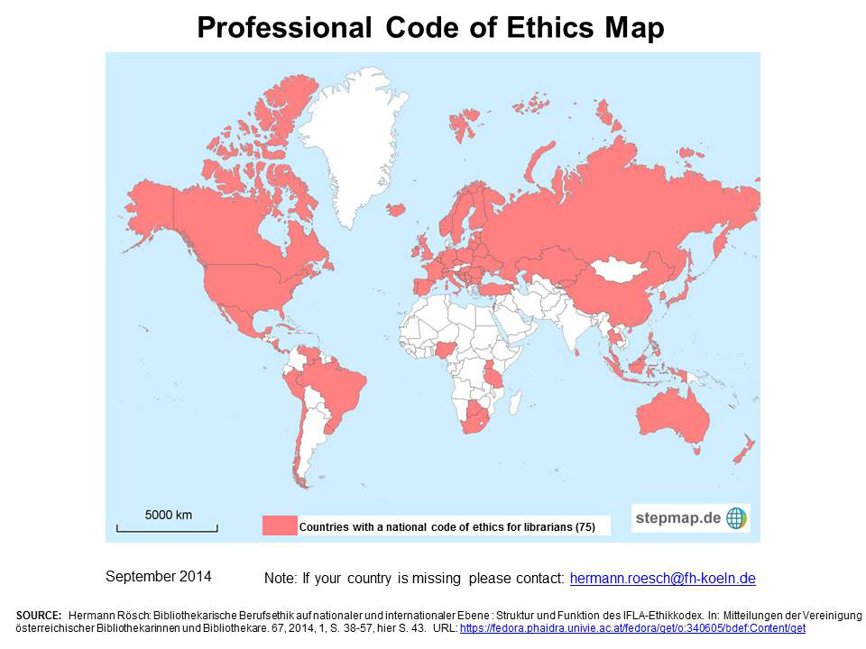

-----

<!-- .slide: data-background-image="img/ideo.jpg" -->

### The goal of design research isn’t to collect data; it’s to synthesize information and provide insight and guidance that leads to action.

#### IDEO

IDEO. (2016). *The Little Book of Design Research*, p.41

-----

<!-- .slide: data-background-image="img/galvan.jpg" -->

### For all the data [Library software vendors] have about our users, you’d think we’d have beautifully customized product[s].

#### Angela Galvan

[Architecture of Authority](https://asgalvan.com/2016/12/05/architecture-of-authority/)

-----

### The library world has been far too gullible, far too willing to regard any technical advance as a service advance.

#### Jonathan D. Lauer & Steve McKinzie

Lauer, J. & McKinzie, S. (2002/2003). Bad moon rising: a candid examination of digital reference and what it means to the profession. *The Reference Librarian*, 79/80, 46.

-----

<!-- .slide: data-background-image="img/salo.jpg" -->

### The ALA Code of Ethics does not say: "We protect each library user's right to privacy and confidentiality ... except for Google Analytics."

#### Dorthea Salo  (Paraphrase by Eric Hellman)

[TK](https://www.youtube.com/watch?v=ZmRfyg3-YDc)

-----

<!-- .slide: data-background-image="img/rams.jpg" -->

### Indifference towards people and the reality in which they live is the one and only cardinal sin in design.

#### Dieter Rams

-----
# What are our Values?

-----

[IFLA: Professional Codes of Ethics for Librarians](https://www.ifla.org/faife/professional-codes-of-ethics-for-librarians#nationalcodes)

-----

-----

<!-- .slide: data-background-image="img/postel.jpg" -->

https://en.wikipedia.org/wiki/File:Jon_Postel_sitting_in_office.jpg

-----

<!-- .slide: data-background-image="img/papanek.jpg" -->

### [The designer’s] social and moral judgment must be brought into play long before [she] begins to design...In other words, will [her] design be on the side of the social good or not.

#### Victor Papanek

Papanek, V. (1971). *Design for the Real World: Human ecology and social change*. New York: Pantheon Books. p. 45.

-----

### The library world has been far too gullible, far too willing to regard any technical advance as a service advance.

#### Jonathan D. Lauer & Steve McKinzie

Lauer, J. & McKinzie, S. (2002/2003). Bad moon rising: a candid examination of digital reference and what it means to the profession. *The Reference Librarian*, 79/80, 46.

Note:

-----

<!-- .slide: data-background-image="img/papanek.jpg" -->

### t.

#### Victor Papanek

Papanek, V. (1971). *Design for the Real World: Human ecology and social change*. New York: Pantheon Books. p. 46.

-----

<!-- .slide: data-background-image="img/montero.jpg" -->

### Design is doing philosophy with your hands.

#### Cameron Tonkenwise

[TK](TK)

Note:

-----

&nbsp;

This slide intentionally left blank.

Note:
Two years ago I spoke at UX Libs and tried to parse out what makes experience design different from industrial or graphic or web design.  I went to my training in phenomenology, the philosophy of experience, for answers, and using Martin Heidegger's ideas of how we interact with the world, I made a case for rethinking how we approach designing experiences. (I'll now summarize that whole talk in two slides.)

-----

<!-- .slide: data-background-image="img/heidegger.jpg" -->

### As we act through technology that has become ready-to-hand, the technology itself disappears from our immediate concerns. We are caught up in the performance of the work.

#### Martin Heidegger

qtd. in Dourish, P. (2004). *Where the action is: the foundation of embodied interaction*. Cambridge, MA: MIT Press.

Note:
For Heidegger, we relate to things in the world in one of two ways: we sometimes feel scientifically detached from things, observing them. You might hold up a hammer and notice its shape and texture, its color and markings. You might do an experiment and measure its density. For Heidegger, observing like this makes the hammer "present-at-hand" to us.

We don't know most of the things of the world as present at hand, most of the time. That's because most things present themselves to us as usful objects that we act through. For Heidegger, when we act through useful objects, they are "ready-to-hand." The objects cease to be separate things to us, and instead become extensions of our bodies. When I'm going to use the hammer to pound a nail into my wall, I'm not observing it as a scientific object. I'm not swinging it while noting its color, or texture, or weight. If I do this, then I will have a hole in my wall. Rather, the hammer becomes an extension of me as I swing it.

-----

### There is a constant movement between present-at-hand and ready-to-hand in everyday life, and designing with that movement in mind is the job of experience designers.

#### Thomas Wendt

[Wendt, T. (TK). *Design for Dasein: Understanding the design of experiences*. p. 155](http://www.designfordasein.com/)

Note:
Only when I miss the nail, or I drop the hammer, does the hammer become something I can observe, something separate from me. When this happens, Heidegger calls it a "breakdown." A lot of the time, users recover from those breakdowns all on their own. Think of making a call with your phone to someone you are close to. You're walking outside on a sunny day and talking away with a big smile on your face. Then suddenly, the call is dropped. You pull the phone away from your face and look at it. Until thta moment, you weren't aware of your phone. You were aware only of your friend's voice in your ear. Now you are staring at a piece of glass in your hand. How did that happen? It was a breakdown! In Heideggarian terms, the phone ceased to be ready-to-hand, and instead became present-at-hand.

These breakdowns will happen, no matter how good our designs are, because people are using them out in the world.

-----

### User-friendliness is not merely an issue of the number of errors made per unit of time.It is rooted in the confidence of being able to handle disruptions.

#### Klaus Krippendorff

Krippendorff, K. (TK). *The Semantic Turn: A new foundation for design*. TK.

Note:
At the end of my talk, I called 

----

# Design for Failure

-----

-----

<!-- .slide: data-background-image="img/postel.jpg" -->

### Robustness Principle: Be conservative in what you do, be liberal in what you accept from others.

#### John Postel

[DOD Standard: Transmission Control Protocol, January 1980](https://tools.ietf.org/html/rfc761#page-13)

Note:

-----

<!-- .slide: data-background-image="img/salo.jpg" -->

### The ALA Code of Ethics does not say: "We protect each library user's right to privacy and confidentiality ... except for Google Analytics."

#### Dorthea Salo  (Paraphrase by Eric Hellman)

[TK](https://www.youtube.com/watch?v=ZmRfyg3-YDc)

-----

-----

# Performance

-----

<!-- .slide: data-background-image="img/bowles.jpg" -->

### Is great UX worth the impact of the landfill?

#### Cennydd Bowles

[The Ethical Designer](https://www.youtube.com/watch?v=SB_GDF-mKTE)

Note:

# Performance

-----

<!-- .slide: data-background-image="img/bowles.jpg" -->

### Is great UX worth the impact of the landfill?

#### Cennydd Bowles

[The Ethical Designer](https://www.youtube.com/watch?v=SB_GDF-mKTE)

Note:

-----

<!-- .slide: data-background-image="img/dash.jpg" -->

### The closest thing Web designers have to HIPPA or an ethical code is “move fast and break things.”

#### Anil Dash

[Privacy, Data Survivalism and a New Tech Ethics, *Note to Self*, Feb 21, 2017](https://www.wnyc.org/story/bonus-privacy-paradox/)

Note:

-----

[IFLA: Professional Codes of Ethics for Librarians](https://www.ifla.org/faife/professional-codes-of-ethics-for-librarians)

Note:
